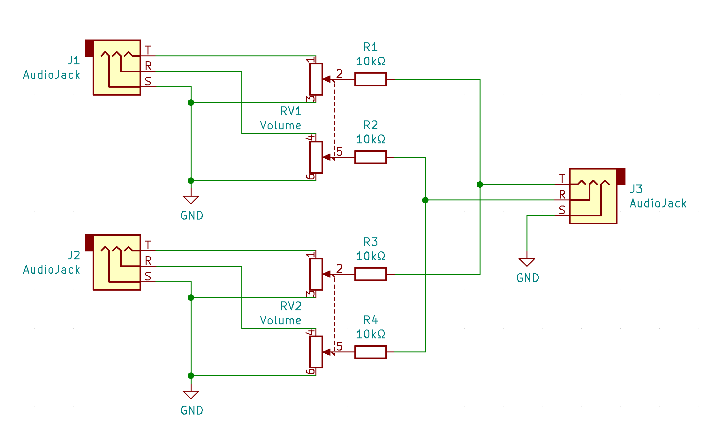
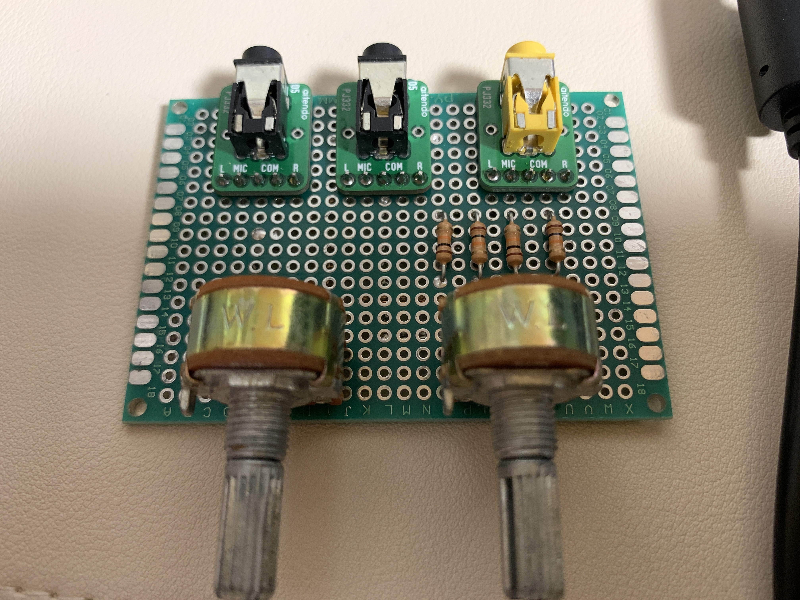
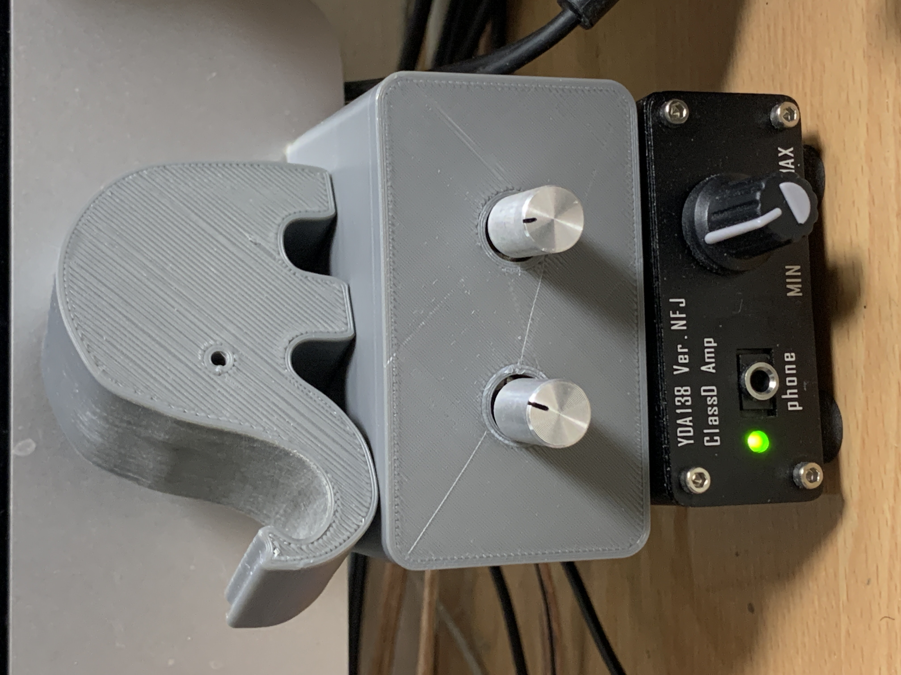

# 超簡単なステレオパッシブミキサーをつくった

デスクには PC とか PS4 とか、複数の機械がある。夜な夜なヘッドホンでゲームしつつ VTuber の配信を見るとかそういう事をするためには、それら機材の音をまとめて 1 つの出力とする必要があった。

具体的にはミキサーが必要だったのだけど、買うと結構高いしけっこうデカくて邪魔そうだし、調べてみたらけっこう簡単に作れそうだったので作ってみた。

回路図はこんなかんじ。左右の信号をそれぞれ可変抵抗(つまりボリューム)に渡してるものを2入力ほど用意して、それぞれ出力を抵抗を通したうえでまとめて出力する。

抵抗を挟むためそのままだと音量が下がる。普通のミキサーはオペアンプとかで出力を増幅しているんだけど、そうすると電源が必要になるし、どうせヘッドホンアンプを繋いでいるのでそっちで出力の音量調整をすればいいやと割り切ることにした。

10kΩの抵抗は、どっちかのボリュームを 0 にしたときに、0 にした側の GND と反対側の入力信号とが短絡しないように挟んでいるもの。ネットで見るとだいたい 4.7kΩ を挟むのが一般的っぽかったが、手元に余ってる抵抗が 10kΩ のものしかなかったのでそれを使用した。

実装はこんなかんじ。aitendo でステレオボリュームとステレオジャックのDip化キットを購入し、ユニバーサル基板上に組み付けた。

3Dプリンタで適当にケースを作成し、完成。見た目はイマイチだし、ちゃんとしたミキサーより多分音とかは悪いんだろうけど、特に問題は感じてないし概ね満足している。

## かかった金額

|もの|単価|個数|小計|
|--|--|--|--|
|ステレオボリューム|50|2|100|
|オーディオジャックwith基板|100|3|300|
|ツマミ|30|2|60||
|**合計**|||**460**|

大変お安くできたので大満足。
