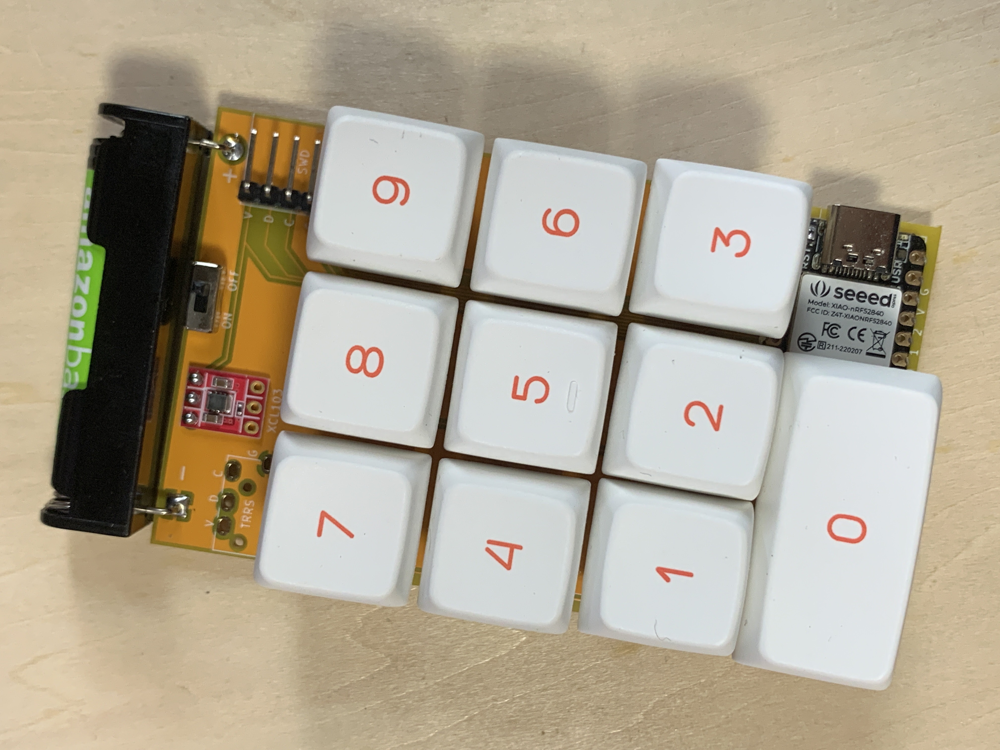
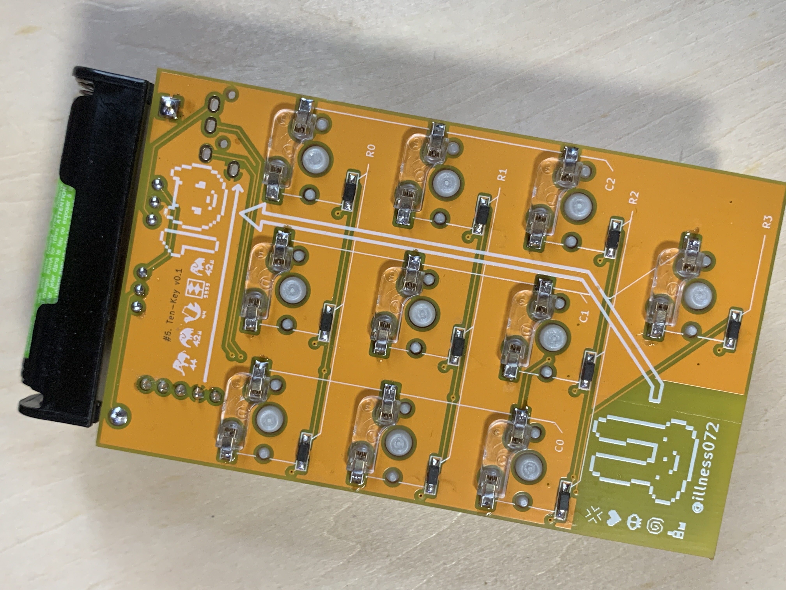

# Ten-Key

Minimalist wireless 10-key Num pad the size of a business card using [XIAO nRF52840 Sense](https://www.seeedstudio.com/Seeed-XIAO-BLE-Sense-nRF52840-p-5253.html).

Created for the [Seed Fusion DIY XIAO Keyboard Contest](https://www.seeedstudio.com/seeed-fusion-diy-xiao-mechanical-keyboard-contest.html) presented by [FusionPCB](https://www.seeedstudio.com/pcb-assembly.html).

|  |  |
|--|--|

## what is this?

Having already created a BLE keyboard using the XIAO nRF52 in another project, I decided to create a simple keyboard for this keyboard contest that would allow people to easily experience the appeal of the XIAO series.

For this project, I received a PCBA of the XIAO nRF52840 Sense, which I am familiar with as a prize for entering the contest, and finished it with wireless specifications using AAA batteries and an XCL103 step-up voltage board.

The keys are not only for entering numbers from 0 to 9 as on Legend, but also for entering various letters and symbols by pressing other keys while holding each key.

Since I used XIAO nRF52 Sense which has a built-in accelerometer, I could lift the board and move the mouse cursor by the tilt of the board.

I used CircuitPython (and KMK Firmware) for the firmware, which allowed for speedy prototyping.

Finally, since I made the board in the size of a Japanese business card, I added some elements that would introduce myself (such as the keyboard icons I have designed in the past, my handle name and icon, etc.) as silks. I am very satisfied with the quality.

## Demo

https://twitter.com/illness072/status/1569666735346970630

# Order through Gallery

You can order PCBA with simple operation.

https://www.seeedstudio.com/Ten-Key-g-1373380

## Other Material

| Component | Quantity |
|--|--|
| [Kailh MX Socket](https://talpkeyboard.net/items/5e02c5405b120c792616bcf9) | 10 |
| [XCL103 step-up voltage board](https://akizukidenshi.com/catalog/g/gK-16116/) | 1 |
| [AAA Battery Holder](https://akizukidenshi.com/catalog/g/gP-02670/) | 1 |
| [slide switch](https://akizukidenshi.com/catalog/g/gP-12723/) | 1 |
